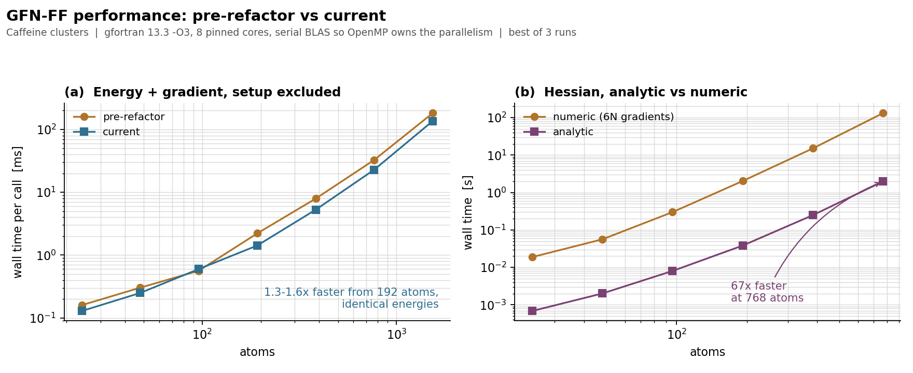

<div align="center">

<h1>GFN-FF</h1>
<h3>A general force field for elements <i>Z</i> = 1–103</h3>


[](https://www.gnu.org/licenses/lgpl-3.0)

</div>

This repository provides a standalone library implementation of the **GFN-FF** method by **S.Spicher** and **S.Grimme**,
adapted from the [`xtb`](https://github.com/grimme-lab/xtb) code (most recently at commit [`6d44803`](https://github.com/grimme-lab/xtb/commit/6d44803)
and validated against that version's results).
The primary purpose is to serve as a linkable dependency for other Fortran, C, and C++ projects.
From this point forward, development may diverge from the upstream `xtb` implementation.

---

## Method

GFN-FF (*Geometries, Frequencies, Non-covalent interactions Force-Field*) is a
completely automated, topology-based force field for fast structure optimisations
and non-covalent interaction energies across the periodic table (Z = 1–103).
The topology and parametrisation are derived entirely from the input geometry,
without user-defined atom types or connectivity.

The following features are available and documented in the associated publications:

- **Molecular GFN-FF**: a generic, partially polarisable force field covering organic,
  organometallic, and biochemical systems
  (S. Spicher, S. Grimme, *Angew. Chem. Int. Ed.* **2020**, 59, 15665.
  [doi:10.1002/anie.202004239](https://doi.org/10.1002/anie.202004239))

- **Periodic boundary conditions / molecular crystals**: adjusted non-covalent
  interactions for lattice energy predictions and unit-cell optimisations of molecular crystals
  (S. Grimme, T. Rose, *Z. Naturforsch. B* **2024**, 79, 191.
  [doi:10.1515/znb-2023-0088](https://doi.org/10.1515/znb-2023-0088))

- **Lanthanide and actinide extension**: reparametrised f-element treatment enabling
  MD simulations and geometry optimisations for large lanthanide- and actinide-containing
  systems
  (T. Rose, M. Bursch, J.-M. Mewes, S. Grimme, *Inorg. Chem.* **2024**.
  [doi:10.1021/acs.inorgchem.4c03215](https://doi.org/10.1021/acs.inorgchem.4c03215))

---

## Building from source

The library requires a Fortran and C compiler (e.g. `gfortran`/`gcc`),
LAPACK/BLAS (e.g. OpenBLAS), and optionally OpenMP.
Both CMake (≥ 3.21) and Meson (≥ 0.59) build systems are supported.

<table>
<tr>
<th>CMake</th>
<th>Meson</th>
</tr>
<tr>
<td>

```bash
cmake -B _build
cmake --build _build
```

To run the test suite:

```bash
cmake -B _build -DWITH_TESTS=ON
cmake --build _build
ctest --test-dir _build
```

</td>
<td>

```bash
meson setup _build
ninja -C _build
```

To run the test suite:

```bash
meson setup _build -Dtests=true
ninja -C _build test
```

</td>
</tr>
</table>

The compiled library (`libgfnff.a` by default) is placed in the build directory
and can be linked into any downstream project.

---

## Library usage

The interface is exposed through the `gfnff_interface` Fortran module and the
`gfnff_interface_c.h` C header (located in `include/`).
Two steps are required: initialise the calculator (topology setup) and call the
singlepoint routine. The initialisation is typically the more expensive step;
once complete, singlepoint evaluations can be called repeatedly on the same
calculator object.

<table>
<tr><td>
<details>
<summary><b>Fortran</b></summary>

```fortran
use iso_fortran_env, only: real64
use gfnff_interface

type(gfnff_data) :: calc
integer  :: nat, ichrg, io
integer,  allocatable :: at(:)
real(real64), allocatable :: xyz(:,:), gradient(:,:)
real(real64) :: energy, sigma(3,3)

! ... populate nat, at, xyz, ichrg ...

call calc%init(nat, at, xyz, ichrg=ichrg, iostat=io)

call calc%singlepoint(nat, at, xyz, energy, gradient, iostat=io, sigma=sigma)

call calc%deallocate()
```

All coordinates are in Bohr; the energy is in Hartree, the gradient in Eh/Bohr,
and `sigma` (3×3) is the stress tensor in Hartree (zero for non-periodic systems).
Full working example: [`app/main.F90`](app/main.F90).

</details>
</td></tr>
<tr><td>
<details>
<summary><b>C</b></summary>

```c
#include "gfnff_interface_c.h"

double sigma[3][3];   /* stress tensor (Hartree); zero for non-PBC */

c_gfnff_calculator calc =
    c_gfnff_calculator_init(nat, at, xyz, ichrg, printlevel, solvent);

c_gfnff_calculator_singlepoint(&calc, nat, at, xyz, &energy, gradient,
                               sigma, &iostat);

c_gfnff_calculator_deallocate(&calc);
```

Full working example: [`test/main.c`](test/main.c).

</details>
</td></tr>
<tr><td>
<details>
<summary><b>C++</b></summary>

```cpp
#include "gfnff_interface_c.h"

double sigma[3][3];   // stress tensor (Hartree); zero for non-PBC

c_gfnff_calculator calc =
    c_gfnff_calculator_init(nat, at, xyz, ichrg, printlevel, solvent);

c_gfnff_calculator_singlepoint(&calc, nat, at, xyz, &energy, gradient,
                               sigma, &iostat);

c_gfnff_calculator_deallocate(&calc);
```

Full working example: [`test/main.cpp`](test/main.cpp).

</details>
</td></tr>
<tr><td>
<details>
<summary><b>Integrating as a CMake subproject</b></summary>

Add the repository as a subdirectory and link against the exported target:

```cmake
add_subdirectory(gfnff)
target_link_libraries(my_target PRIVATE gfnff)
```

</details>
</td></tr>
<tr><td>
<details>
<summary><b>Integrating as a Meson subproject</b></summary>

Place the repository under `subprojects/gfnff/` and wrap it:

```meson
gfnff_dep = dependency('gfnff', fallback: ['gfnff', 'gfnff_dep'])
```

</details>
</td></tr>
</table>

---

## Periodic boundary conditions

PBC support is available via `c_gfnff_calculator_init_pbc` on the C/C++ side
and via an optional `lattice` argument to `calc%init` in Fortran.
See the PBC sections in [`test/main.c`](test/main.c) and [`test/main.cpp`](test/main.cpp)
for worked examples.

---

## Performance



Caffeine clusters from 24 to 1536 atoms, gfortran 13.3 `-O3`, pinned to 8
physical cores, serial BLAS so that OpenMP provides the parallelism, best of 3
runs. Both trees give the same energies to 2e-16.

- **(a)** Energy and gradient are 1.3–1.6x faster than the pre-refactor tree
  from 192 atoms upwards. Below that a call takes about a millisecond or less
  and the ratio is dominated by timer noise.
- **(b)** The analytic Hessian is 27x faster than a full 6N-gradient finite
  difference at 24 atoms and 67x faster at 768 atoms (2 s instead of 132 s).

The setup is unchanged by the refactor and remains the practical size limit: at
1536 atoms topology perception takes ~3.6 s against ~136 ms for a gradient. The
speedup in (a) is a parallel one. On a single thread at 1536 atoms the current
tree is ~16% slower (312 ms vs 269 ms), but it scales to 2.4x on 8 cores where
the old tree reaches 1.6x.

The analytic Hessian is dominated by three large `DGEMM` calls and one
factorise-and-solve step. The electrostatic, dispersion and bond terms together
account for ~93% of it, and each contracts a `(3N,N)` derivative block into the
`(3N,3N)` Hessian. Its OpenMP parallelisation therefore gains only ~1.1x on 8
cores, whereas a threaded BLAS gives ~3.5x. Hessian performance hence depends
mainly on the linear algebra backend. Reference netlib LAPACK is serial and
costs roughly 1.6x on singlepoints and considerably more on Hessians.
`find_package(LAPACK)` takes the first library it finds; pass
`-DBLA_VENDOR=...` (e.g. `OpenBLAS`, `Intel10_64lp`) to select one explicitly.

The benchmark harness is in `bench/` (untracked, it generates its own
structures); `bench/run.sh` reproduces the raw numbers and `bench/plot.py`
redraws the figure.

---

## Python bindings

Python bindings are provided through a `ctypes`-based interface.
The shared library is bundled into a binary wheel, so no Fortran or C compiler
is needed at install time.

### Installation

Binary wheels for Linux (x86\_64) and macOS (x86\_64 / arm64) are published on PyPI:

```bash
pip install gfnff          # library only
pip install "gfnff[ase]"   # + ASE (enables the CLI and the ASE calculator)
```

### Building from source

The source build compiles the Fortran library on your machine.
The following **system packages** must be present before running pip:

| Dependency | Example (Debian/Ubuntu) | Example (Fedora/RHEL) | Example (macOS) |
|---|---|---|---|
| Fortran compiler | `apt install gfortran` | `dnf install gcc-gfortran` | `brew install gcc` |
| LAPACK + BLAS | `apt install libopenblas-dev` | `dnf install openblas-devel` | `brew install openblas` |
| CMake ≥ 3.21 | installed by pip automatically | ← | ← |

Once those are in place:

```bash
pip install ".[ase]"           # from a checkout
pip install "gfnff[ase]" --no-binary gfnff   # force source build from PyPI
```

### Command-line interface

Installing `gfnff[ase]` places a `gfnff` executable on your PATH.

```
gfnff <input> [options]
```

The input file is read by ASE, so any format it supports works (xyz, extxyz, POSCAR, cif, …).

**Singlepoint** (default):

```bash
gfnff molecule.xyz
gfnff molecule.xyz --chrg -1
gfnff molecule.xyz --alpb h2o        # implicit solvation (--solv is an alias)
```

**Geometry optimisation** (L-BFGS via ASE, cell fixed, writes `gfnff.log.extxyz`):

```bash
gfnff molecule.xyz --opt
gfnff molecule.xyz --opt --fmax 0.05          # looser convergence, eV/Å
gfnff molecule.xyz --opt --outfile path.xyz   # custom trajectory file
gfnff molecule.xyz --opt --alpb acetone       # optimise in solvent
```

**Variable-cell optimisation** (L-BFGS + `ExpCellFilter`, periodic systems only):

```bash
gfnff crystal.cif --optcell
gfnff crystal.cif --optcell --fmax 0.01
```

Full option list: `gfnff --help`

The trajectory file (`gfnff.log.extxyz`) stores energy and forces in each
frame header, compatible with ASE's `ase gui`.

---

### Low-level API (`GFNFFCalculator`)

`GFNFFCalculator` mirrors the C API one-to-one.
All quantities use the same units as the library itself: **Bohr** for coordinates and lattice, **Hartree** for energy, **Eh/Bohr** for gradients, and **Hartree** for the stress tensor.

```python
import numpy as np
from gfnff import GFNFFCalculator

# Atomic numbers and coordinates in Bohr
numbers = np.array([6, 8, 1, 1], dtype=np.int32)   # CO + 2 H
positions = np.array([[0, 0, 0], [2.1, 0, 0],
                      [-1.0, 0, 0], [3.1, 0, 0]], dtype=np.float64)

with GFNFFCalculator(numbers, positions, charge=0, printlevel=0) as calc:
    energy, gradient, sigma = calc.singlepoint(numbers, positions)
    print(f"Energy: {energy:.6f} Eh")
    print(f"Gradient shape: {gradient.shape}")  # (nat, 3)
    print(f"Stress tensor:\n{sigma}")            # (3, 3), Hartree; zero for non-PBC
```

Periodic systems use a separate initialiser:

```python
calc = GFNFFCalculator(
    numbers, positions,
    lattice=lattice_bohr,   # shape (3, 3), rows are lattice vectors
    npbc=3,
)
```

Partial charges are those of the last singlepoint, where they are obtained as
part of the energy evaluation:

```python
with GFNFFCalculator(numbers, positions) as calc:
    calc.singlepoint(numbers, positions)
    q = calc.charges()      # (nat,), in e; sums to the total charge
```

### Choosing a parametrisation

Both calculators take `version` and `parametrisation`.

```python
from gfnff import GFNFFCalculator, Version

# a different force-field version
calc = GFNFFCalculator(numbers, positions, version="harmonic2020")
calc = GFNFFCalculator(numbers, positions, version=Version.harmonic2020)  # same

# a custom parameter file, overlaid on the internal set for that version
calc = GFNFFCalculator(numbers, positions, parametrisation="my-set.toml")
```

| `version` | Effect |
|-----------|--------|
| `None` *(default)* | `angewChem2020_2` |
| `angewChem2020`, `angewChem2020_1`, `angewChem2020_2` | identical in practice; nothing branches on the distinction, here or in xtb |
| `harmonic2020` | harmonic bond potential for 2D→3D conversion; runs no EEQ solve, so `charges()` raises |
| `mcgfnff2023` | molecular crystals; rejected for non-periodic systems |
| `conformer2020` | `angewChem2020_2` with bonds that cannot dissociate, see below |

#### `conformer2020`: bonds that cannot break

The published bond term is a Gaussian well in the deviation from a
CN-dependent reference length. It has an inflection point at about 0.5 Å of
stretch and decays to zero beyond it, so a bond can be pulled apart for a
finite cost and the molecule can dissociate during an optimisation or an MD
run while the bond list still contains the bond.

`conformer2020` keeps that well exactly where it is convex and continues it
past the inflection point along its own tangent, which rises without bound at
a constant restoring force. The join is C², so gradients and Hessians stay
continuous.

Inside the convex region the results are bit-identical to `angewChem2020_2`,
since the same code path runs. At the GFN-FF minimum of caffeine
the most stretched bond sits 0.17 Å from its reference, against a switch at
0.49 Å, so ordinary conformers, thermal MD and normal strain never reach the
continuation:

```python
atoms.calc = GFNFF(version="conformer2020")   # same energies, no dissociation
```

Pulling one C–H bond out with the topology held fixed, energies relative to
the minimum in eV:

| stretch | `angewChem2020_2` | `conformer2020` |
|--------:|------------------:|----------------:|
| 0.2 Å | 0.54 | 0.54 |
| 0.4 Å | 1.93 | 1.93 |
| 1.0 Å | 4.18 | 5.33 |
| 4.0 Å | 4.52 | 20.77 |
| 8.0 Å | 4.52 | 41.35 |

The published term saturates at its well depth; the variant climbs at
5.15 eV/Å, which is `sqrt(2α)·D·exp(-1/2)` for that bond.

All other terms are unchanged. The angle and torsion terms are damped to zero
as their bonds stretch, but the damping is never reached once the bonds cannot
stretch that far, so these terms need no modification.

### Supplying the molecular graph

By default GFN-FF works out the connectivity from the geometry. `bond_matrix`
replaces that step with a graph you supply, an `(nat, nat)` integer matrix
where a nonzero element declares a bond:

```python
calc = GFNFFCalculator(numbers, positions, bond_matrix=bm)
atoms.calc = GFNFF(bond_matrix=bm)          # or atoms.info["bond_matrix"] = bm
```

Handing back the graph GFN-FF would have perceived reproduces the same force
field exactly, i.e. `bond_matrix` overrides the perception and is not a
separate mode. It works with every version.

The matrix must be symmetric, zero on the diagonal, non-negative, and carry at
most 41 bonds per atom. All of this is checked, and a violation is an error.
Molecular systems only, since a graph has no cell index. Only the zero/nonzero
pattern is currently used. The magnitudes are validated and stored, but not
read: GFN-FF derives its own π bond orders from a Hückel
treatment, and `harmonic2020` uses the bond list alone.

#### Building a structure from a graph

The option exists because with `harmonic2020` the entire force field is
determined by the graph and the elements. Its bond term targets
`0.7·(rcov_i + rcov_j)`, its topological charges come from a shortest-path walk
over the graph, and its pair exponents follow from those. The geometry enters
only through the repulsion. Random atom positions plus a graph are therefore
sufficient to build a structure:

```python
from ase.optimize import BFGS
from gfnff import GFNFF

soup.calc = GFNFF(version="harmonic2020", bond_matrix=bm)   # random positions
BFGS(soup).run(fmax=1e-3)                                   # -> 3D structure
soup.calc = GFNFF()                                         # then regular GFN-FF
BFGS(soup).run(fmax=1e-3)
```

Starting from uniformly random coordinates, caffeine is recovered with the correct
bond lengths (1.261 ± 0.205 Å against 1.261 ± 0.152 Å for the reference), and
relaxing that with ordinary GFN-FF reaches the same minimum to within 0.002 eV.

When a graph is supplied *and* the version is `harmonic2020`, the perception
phases are skipped entirely: rings, hybridisation, π systems and the bonded
parameters all read the geometry, which in this mode carries no information.

A `.toml` parameter file is an **overlay**: it need only name the keys it
changes, and the rest keep the internal values for the selected version. See
[`param/README.md`](param/README.md) for the format and for how to dump the
current set as a starting point. TOML support needs a build with toml-f
(`gfnff._lib.toml_available()`).

### ASE Calculator (`GFNFF`)

`GFNFF` is a fully compatible [ASE `Calculator`](https://wiki.fysik.dtu.dk/ase/ase/calculators/calculators.html).
It handles unit conversion automatically (Å ↔ Bohr, eV ↔ Hartree).
Implemented properties: **energy**, **forces**, **stress**, **charges**.

```python
from ase.build import molecule
from gfnff import GFNFF

atoms = molecule("caffeine")
atoms.calc = GFNFF()

energy = atoms.get_potential_energy()   # eV
forces = atoms.get_forces()             # eV / Å, shape (nat, 3)
stress = atoms.get_stress()             # eV / ų, Voigt [xx,yy,zz,yz,xz,xy]; zero for non-PBC
charges = atoms.get_charges()           # e, shape (nat,)
```

Periodic systems work the same way; provide an `atoms` object with `cell` and `pbc` set:

```python
from ase.io import read
from gfnff import GFNFF

atoms = read("quartz.cif")
atoms.calc = GFNFF()
print(atoms.get_potential_energy())  # eV / unit cell
print(atoms.get_stress())            # eV / ų, Voigt
```

#### Hessian and vibrations

The Hessian is an explicit method rather than one of `implemented_properties`,
so it is never computed as a side effect of an MD or optimisation step:

```python
hessian = atoms.calc.get_hessian(atoms)   # (3N, 3N), eV / Ų

vib = atoms.calc.get_vibrations(atoms)    # ase.vibrations.VibrationsData
vib.get_energies()                        # frequencies, normal modes,
vib.get_modes()                           # thermochemistry, all from ASE
```

`get_vibrations()` passes the analytic Hessian directly to ASE, which avoids the 6N
displaced singlepoints that `ase.vibrations.Vibrations` would otherwise run. Results
for an unchanged geometry are cached, so asking for frequencies and modes does
not evaluate it twice. Non-periodic systems only.

Variable-cell relaxation via ASE's `ExpCellFilter`:

```python
from ase.filters import ExpCellFilter
from ase.optimize import LBFGS

opt = LBFGS(ExpCellFilter(atoms))
opt.run(fmax=0.01)
```

Additional options:

| Parameter | Default | Description |
|-----------|---------|-------------|
| `charge` | `0` | Total charge. Also reads `atoms.info["charge"]` (takes precedence). |
| `solvent` | `""` | Implicit solvent name: `"h2o"`, `"acetone"`, `"chcl3"`, … (molecular systems only) |
| `printlevel` | `0` | Fortran output verbosity (0 = silent, 3 = verbose). |
| `version` | `None` | Parametrisation version; see the table above. |
| `parametrisation` | `None` | Path to a parameter file, overlaid on that version. |

Changing any of these with `calc.set(...)` rebuilds the underlying force field
rather than reusing the cached result.

### Running the tests

```bash
pip install "gfnff[test]"
pytest python/tests/
```

---

## License

This project is licensed (as the original `xtb` code) under the **GNU Lesser General Public License v3** or later.
See [`LICENSE`](LICENSE) for details.
