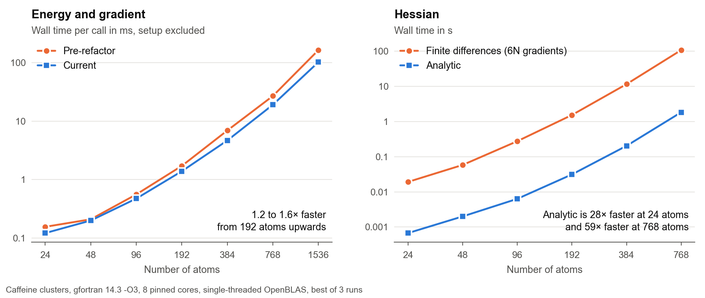

<div align="center">

<h1>GFN-FF</h1>
<h3>A general force field for elements <i>Z</i> = 1–103</h3>


[](https://www.gnu.org/licenses/lgpl-3.0)

</div>

A standalone library implementation of the **GFN-FF** method by S. Spicher and S. Grimme,
adapted from the [`xtb`](https://github.com/grimme-lab/xtb) code (most recently at commit
[`6d44803`](https://github.com/grimme-lab/xtb/commit/6d44803) and validated against that version's results).
It is meant to be linked into other Fortran, C, and C++ projects, and it also ships Python bindings.
From this point forward, development may diverge from the upstream `xtb` implementation.
As of version `v0.3.0` of this repository divergence is the case in order to add analytical Hessians and other features.

GFN-FF (*Geometries, Frequencies, Non-covalent interactions Force-Field*) is a
completely automated, topology-based force field for fast structure optimisations
and non-covalent interaction energies.
The topology and parametrisation are derived entirely from the input geometry,
without user-defined atom types or connectivity.

## Quick start

```bash
pip install "gfnff[ase]"
```

```python
from ase.build import molecule
from gfnff import GFNFF

atoms = molecule("caffeine")
atoms.calc = GFNFF()

energy = atoms.get_potential_energy()   # eV
forces = atoms.get_forces()             # eV / Å
```

The same install provides a command-line tool:

```bash
gfnff molecule.xyz --opt --alpb h2o
```

## Documentation

| Topic | Page |
|---|---|
| Fortran, C and C++ interfaces, periodic systems, use as a CMake or Meson subproject | [docs/library.md](docs/library.md) |
| Python: installation, command-line tool, `GFNFFCalculator`, ASE calculator, Hessians | [docs/python.md](docs/python.md) |
| Force-field versions, `conformer2020`, custom parameter files, user-supplied molecular graphs | [docs/parametrisation.md](docs/parametrisation.md) |
| Benchmarks and choice of BLAS backend | [docs/performance.md](docs/performance.md) |
| TOML parameter file format | [param/README.md](param/README.md) |

## Building from source

The library requires a Fortran and C compiler (e.g. `gfortran`/`gcc`),
LAPACK/BLAS (e.g. OpenBLAS), and optionally OpenMP.
Both CMake (≥ 3.21) and Meson (≥ 0.59) are supported.

| | CMake | Meson |
|---|---|---|
| Build | `cmake -B _build`<br>`cmake --build _build` | `meson setup _build`<br>`ninja -C _build` |
| Test | `cmake -B _build -DWITH_TESTS=ON`<br>`cmake --build _build`<br>`ctest --test-dir _build` | `meson setup _build -Dtests=true`<br>`ninja -C _build test` |

The compiled library (`libgfnff.a` by default) is placed in the build directory
and can be linked into any downstream project.

## Using the library

Initialise a calculator once (topology setup, the expensive step), then call the
singlepoint routine as often as needed:

```fortran
use gfnff_interface
type(gfnff_data) :: calc

call calc%init(nat, at, xyz, ichrg=ichrg, iostat=io)
call calc%singlepoint(nat, at, xyz, energy, gradient, iostat=io, sigma=sigma)
call calc%deallocate()
```

Coordinates are in Bohr, energies in Hartree, gradients in Eh/Bohr.
The C/C++ header `include/gfnff_interface_c.h` mirrors these calls;
see [docs/library.md](docs/library.md).

## Performance



Caffeine clusters from 24 to 1536 atoms on 8 cores.
Energy and gradient are 1.3–1.6x faster than the pre-refactor code from 192 atoms upwards,
and the analytic Hessian is 27x (24 atoms) to 67x (768 atoms) faster than finite differences.
Hessian speed depends mainly on the BLAS backend; details are in
[docs/performance.md](docs/performance.md).

## References

- **Molecular GFN-FF**, a generic, partially polarisable force field covering organic,
  organometallic, and biochemical systems:
  S. Spicher, S. Grimme, *Angew. Chem. Int. Ed.* **2020**, 59, 15665.
  [doi:10.1002/anie.202004239](https://doi.org/10.1002/anie.202004239)
- **Periodic boundary conditions and molecular crystals**, with adjusted non-covalent
  interactions for lattice energies and unit-cell optimisations:
  S. Grimme, T. Rose, *Z. Naturforsch. B* **2024**, 79, 191.
  [doi:10.1515/znb-2023-0088](https://doi.org/10.1515/znb-2023-0088)
- **Lanthanide and actinide extension**, a reparametrised f-element treatment:
  T. Rose, M. Bursch, J.-M. Mewes, S. Grimme, *Inorg. Chem.* **2024**.
  [doi:10.1021/acs.inorgchem.4c03215](https://doi.org/10.1021/acs.inorgchem.4c03215)

## License

This project is licensed (as the original `xtb` code) under the **GNU Lesser General Public License v3** or later.
See [`LICENSE`](LICENSE) for details.
